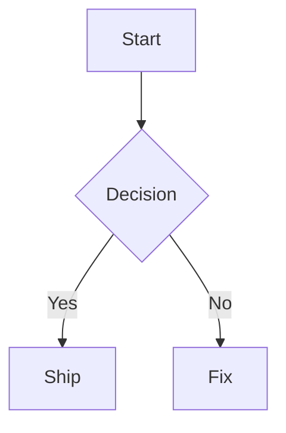
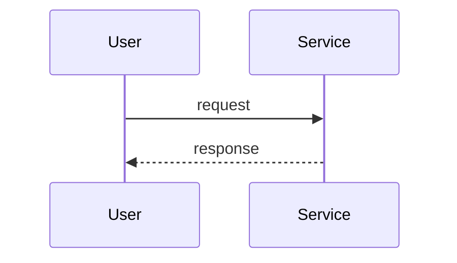

# Mermaid Fixture

This file contains two mermaid diagrams.

```mermaid
flowchart TD
  A[Start] --> B{Decision}
  B -->|Yes| C[Ship]
  B -->|No| D[Fix]
```

Some text in between.

```mermaid
sequenceDiagram
  participant U as User
  participant S as Service
  U->>S: request
  S-->>U: response
```
